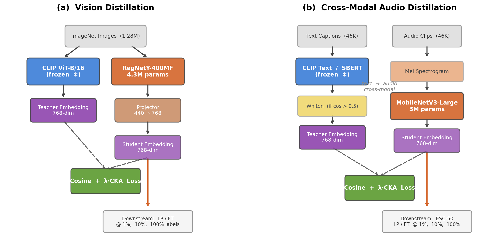

# Platonic Initialization: Project Summary

**Date:** March 27, 2026

---

## Aim

The platonic representation hypothesis posits that large models trained on different data and objectives converge toward a shared geometric structure — a "platonic" representation of reality. Our core hypothesis is that **weights which produce an output geometry close to this platonic structure provide a better initialization for downstream learning**, yielding faster convergence and stronger generalization, especially in low-data regimes. If true, distilling the embedding geometry of a foundation model (e.g., CLIP) into a tiny student should produce an initialization that is systematically superior to one derived from a narrower supervisory signal (e.g., ImageNet classification), because the foundation model's geometry better approximates the platonic ideal. We test this by compressing foundation model embeddings into small models (<5M parameters) via distillation across two modalities (vision, audio), multiple teachers (CLIP, supervised ViT, Sentence-BERT), and evaluating downstream classification under linear probing (which directly tests representation quality) and fine-tuning (which allows downstream SGD to compensate for initialization). We compare against supervised geometry (supervised ViT) and in-domain pretraining baselines (ImageNet pretrained, AudioSet pretrained).

---

## Methodology

### Vision Pipeline

**Teachers:** CLIP ViT-B/16 (768-dim) and Supervised ViT-B/16, both frozen.
**Student:** RegNetY-400MF (4.3M params, 440-dim backbone) with a linear projector (440 -> teacher dim).
**Distillation data:** ImageNet (1.28M images), 20 epochs, AdamW, batch size 512.
**Loss variants:** (1) Cosine embedding loss, (2) Cosine + CKA structural loss (lambda=0.1), (3) CKA-only (no cosine alignment).
**Downstream:** 6 natural-image datasets (VOC, Pets, EuroSAT, DTD, Flowers-102, Imagenette) + 3 medical imaging datasets (PathMNIST, DermaMNIST, BloodMNIST). Fine-tuning and linear probe at 1%, 10%, 100% labels. SGD with momentum, cosine LR schedule.

### Audio Pipeline

**Teachers:** CLIP ViT-L/14 text encoder (768-dim) and Sentence-BERT all-mpnet-base-v2 (768-dim), both processing text captions from AudioCaps (46K audio-caption pairs). The teacher has never heard audio — any downstream audio performance comes purely from transferring text-derived geometry across modalities.
**Student:** MobileNetV3-Large (3M params, 960-dim backbone) processing mel spectrograms.
**Downstream:** ESC-50 (50 environmental sound classes, 2000 clips, 5-fold cross-validation).
**Ceiling:** EfficientAT MobileNetV3 pretrained on AudioSet (2M labeled audio clips).

### Evaluation Protocol

- **Linear probe (LP):** Frozen backbone, train only classification head. Tests representation quality directly.
- **Fine-tuning (FT):** Full model adaptation. Allows downstream SGD to compensate for initialization.
- **Label fractions:** 1%, 10%, 100% with stratified sampling.

---

## Vision Findings

### Table 1: Vision Linear Probe Accuracy (%) at 100% Labels

Student: RegNetY-400MF distilled on ImageNet. "Gap closed" measures the fraction of the supervised-distilled to ImageNet-pretrained gap that CLIP closes.

| Init | VOC | Pets | EuroSAT | DTD | Flowers | Imagenette |
|------|-----|------|---------|-----|---------|------------|
| Random | 9.0 | 5.1 | 48.5 | 7.5 | 4.9 | 29.2 |
| Supervised-distilled | 66.2 | 65.3 | 92.3 | 44.0 | 53.2 | 90.7 |
| **CLIP-distilled** | **82.5** | **81.1** | **94.1** | **54.1** | **70.9** | **96.6** |
| ImageNet pretrained | 85.2 | 91.2 | 94.4 | 63.0 | 76.2 | 99.4 |
| Gap closed (%) | 86 | 61 | -- | 53 | 77 | 68 |

CLIP-distilled features are 10-20pp better than supervised-distilled across all six datasets. CLIP closes 53-87% of the gap to ImageNet pretraining.

### CKA-Only: Isolating Structural Geometry

CKA-only distillation transfers only the relational structure of the teacher (which samples are similar/dissimilar) without matching individual embedding values. This isolates the "platonic" claim: is CLIP's geometric arrangement of concepts superior to supervised geometry?

**Table 2: CKA-only Linear Probe — CLIP vs Supervised (%, delta in pp)**

| Dataset | CLIP CKA-only | Sup CKA-only | Delta |
|---------|--------------|-------------|-------|
| VOC 1% | **21.8** | 13.6 | +8.2 |
| VOC 100% | **75.6** | 56.9 | +18.7 |
| Pets 1% | **26.6** | 14.4 | +12.2 |
| Pets 10% | **58.6** | 38.5 | +20.1 |
| Pets 100% | **74.2** | 53.8 | +20.4 |
| EuroSAT 1% | **78.5** | 73.0 | +5.5 |
| EuroSAT 100% | **89.3** | 89.2 | +0.1 |
| DTD 100% | **51.9** | 44.1 | +7.8 |
| Flowers 100% | **63.4** | 47.1 | +16.4 |
| Imagenette 1% | **89.6** | 73.6 | +16.0 |
| Imagenette 100% | **94.8** | 88.8 | +5.9 |

**CLIP wins 15/15 LP comparisons**, average margin +10.5pp. When the backbone is frozen and only geometric structure is transferred, CLIP produces a categorically better representation than supervised training. The margins are large and consistent — not noise.

Under **fine-tuning**, the same comparison yields 8/16 — a coin flip. Fine-tuning overwrites the initialization, erasing CLIP's structural advantage.

### Content vs Structure

**Table 3: CKA-only vs CKA+cosine — win rates**

| Condition | CKA-only wins | CKA+cosine wins |
|-----------|--------------|----------------|
| CLIP fine-tune | 3/16 | **13/16** |
| Supervised fine-tune | 6/16 | **10/16** |
| CLIP linear probe | 1/16 | **15/16** |
| Supervised linear probe | 1/15 | **14/15** |
| **Overall** | **11/63** | **52/63** |

Selected comparisons showing the magnitude of the content advantage:

| Dataset | CLIP CKA-only | CLIP CKA+cos | Delta |
|---------|--------------|-------------|-------|
| VOC LP 100% | 75.6 | **80.4** | +4.8 |
| VOC FT 10% | 19.9 | **60.7** | +40.8 |
| Pets LP 100% | 74.2 | **81.5** | +7.3 |
| Flowers LP 100% | 63.4 | **66.7** | +3.3 |
| Imagenette LP 100% | 94.8 | **96.5** | +1.7 |

CKA+cosine (combined) beats CKA-only on **52/63** comparisons overall. Point-wise embedding content provides substantial information beyond structural alignment. The largest gaps appear at low label fractions (VOC at 10%: 40pp difference). The pattern is clear: structure alone captures the relational geometry, but per-sample anchoring from cosine loss adds discriminative information that structure cannot.

### Teacher Scale

Scaling the CLIP teacher from ViT-B (86M params) to ViT-L (304M params), both distilled with cosine + CKA (λ=0.1), does not improve the distilled student. ViT-B wins 7/10 comparisons at 100% labels and 5/7 at 1% labels — with *larger* margins at low data (up to 15.9pp). The 4.3M-parameter student is the capacity bottleneck, not teacher quality. (See [Appendix A](#appendix-a-teacher-scale) for full comparison.)

### OOD Medical Imaging

Three MedMNIST datasets (PathMNIST, DermaMNIST, BloodMNIST) test whether CLIP geometry helps on domains distant from ImageNet.

**ImageNet pretraining still dominates:** wins 13/18 comparisons vs CLIP-CKA0.1 and 14/18 vs CLIP-CKAonly. ImageNet's low-level visual features (edges, textures, color gradients) transfer to medical microscopy far better than expected.

**The exception — DermaMNIST LP:** CLIP-distilled beats ImageNet pretrained at all three label fractions under linear probe (CKAonly: +1.7pp at 1%, +3.0pp at 10%, +2.2pp at 100%). This is the smallest dataset (7K train, 7 classes) where frozen high-level semantic features matter most.

**Foundation > supervised holds on OOD:** CLIP-distilled beats Supervised-distilled on 14/18 comparisons (CKA0.1), confirming that foundation geometry > supervised geometry even on medical imaging.

---

## Audio Findings

### Table 2: ESC-50 5-Fold CV Accuracy (%)

Audio student: MobileNetV3-Large. FT = fine-tuning, LP = linear probe. Teachers see only text captions; the student sees mel spectrograms.

| Condition | 100% FT | 100% LP | 10% FT | 10% LP | 1% FT | 1% LP |
|-----------|---------|---------|--------|--------|-------|-------|
| Random | 70.2 | 13.4 | 13.8 | 5.2 | 8.2 | 3.8 |
| CLIP text (raw) | 75.0 | 4.2 | 19.5 | 3.4 | 8.1 | 9.3 |
| CLIP text (whitened) | 83.9 | 75.6 | 57.9 | 56.6 | **43.6** | **43.6** |
| SBERT (raw) | **86.0** | 74.5 | **60.8** | **58.0** | 41.0 | 41.8 |
| SBERT (whitened) | 82.4 | 73.2 | 54.4 | 52.9 | 32.2 | 36.2 |
| CLIP CKA-only | 80.9 | 67.1 | 50.3 | 47.4 | 32.6 | 32.4 |
| SBERT CKA-only | 81.4 | 69.9 | 52.9 | 49.6 | 30.2 | 30.4 |
| *AudioSet pretrained* | *96.9* | *89.2* | *73.8* | *54.7* | *34.8* | *30.3* |

### Cone Collapse and Its Solutions

**The problem:** CLIP text embeddings of AudioCaps captions have mean pairwise cosine similarity of 0.663 — nearly all embeddings point in the same direction. Distilling with cosine loss forces the student to map all audio to roughly the same point. Result: raw CLIP LP (4.2%) is worse than random (13.4%).

**Diagnosis:** The cone is domain-specific. CLIP embeddings of COCO image captions have mean cosine 0.36 (well-spread). CLIP's text encoder compresses out-of-distribution audio descriptions into a narrow subspace.

**Two independent solutions:**

| Approach | Mechanism | 100% LP result |
|----------|-----------|---------------|
| Whitened embedding loss | Preprocess embeddings to remove the cone, then transfer content + structure | 75.6% (+71.4pp vs raw) |
| CKA-only loss | Ignore the cone — only transfer relative similarities | 67.1% (+62.9pp vs raw) |
| Raw embedding loss | Inherits the cone directly — student collapses | 4.2% |

Whitening is stronger because it preserves both structure and per-sample anchoring. CKA-only transfers only batch-level similarity structure.

**Whitening is asymmetric:** Whitening hurts Sentence-BERT by 5.2pp on average. It is a targeted fix for cone collapse, not a universal preprocessing step. Practical diagnostic: if mean pairwise cosine exceeds ~0.5, whiten before distillation.

### Convergence of CLIP and SBERT

The 40pp raw gap between CLIP and SBERT shrinks dramatically under structural equalization:

| Comparison | Avg absolute difference |
|------------|------------------------|
| CLIP embed vs SBERT embed (raw) | **40.3pp** (SBERT dominates) |
| CLIP CKA-only vs SBERT CKA-only | **2.1pp** (near-identical) |
| CLIP whitened vs SBERT raw | **<1pp** (3-3 split) |

Three different ways to remove the cone artifact converge on the same answer: the underlying relational structure of CLIP and SBERT is approximately the same. The 40pp gap from raw embedding loss was entirely an artifact of the cone, not a fundamental difference in semantic organization.

### Beats AudioSet Pretraining at 1% Labels

At 1% labels, both whitened CLIP (43.6% FT, 43.6% LP) and raw SBERT (41.0% FT, 41.8% LP) exceed the AudioSet-pretrained ceiling (34.8% FT, 30.3% LP) — despite the text teachers never hearing audio and training on only 46K caption-audio pairs vs AudioSet's 2M clips.

---

## Cross-Cutting Findings

**Fine-tuning reduces all initialization advantages.** The geometry signal is only cleanly visible under linear probe. Fine-tuning allows downstream SGD to compensate for initialization quality, washing out structural differences. This is consistent across vision (CKA-only CLIP vs supervised: 15/15 LP but 8/16 FT) and audio.

**CLIP geometry > supervised geometry is the most consistent finding.** 15/15 LP under CKA-only vision, 14/18 on medical imaging. Even when CLIP loses to ImageNet pretraining, it consistently beats supervised distillation.

**Content alignment > structural alignment.** CKA+cosine beats CKA-only on 52/63 vision comparisons. Whitened embedding loss beats CKA-only by ~8pp average on audio. Point-wise anchoring and denser gradient signal provide value beyond what relational structure captures.

**Practical recipe for new domains:** Compute mean pairwise cosine similarity of teacher embeddings on your data. If >0.5, whiten before distillation. Alternatively, use CKA-only loss, which is cone-invariant but somewhat weaker.

---

## Guided Questions

Before reading our assessment, consider the evidence and form your own conclusions:

1. **Is foundation (CLIP) geometry better than supervised geometry?**
   Evidence: Table 1 LP shows 10-20pp advantage. CKA-only LP: 15/15 wins, +10.5pp avg. Medical imaging: 14/18. Does this establish geometric superiority, or could the advantage come from CLIP's broader training data rather than a "platonic" structure?

2. **Does geometric structure alone suffice for good transfer?**
   Evidence: CKA+cosine beats CKA-only on 52/63 comparisons. Whitened embedding beats CKA-only by ~8pp on audio. But CKA-only still produces useful features (+63pp over raw CLIP on audio, 15/15 LP vision). Is structure "sufficient but suboptimal" or "insufficient"?

3. **Can foundation distillation replace in-domain pretraining?**
   Evidence: Vision closes 53-87% of the ImageNet gap. Audio beats AudioSet at 1% labels. Medical imaging: ImageNet still wins 13/18. Where does distillation work as a practical alternative?

4. **Do different foundation models converge to shared structure?**
   Evidence: CLIP vs SBERT under CKA-only: 2.1pp difference (down from 40pp raw). Whitened convergence: <1pp. These are very different models (image-text contrastive vs text-only paraphrase). Is 2.1pp "the same structure" or "somewhat similar structure"?

*Form your own conclusions before reading on.*

---

## Our Verdict

**Partially supported, with caveats.**

**Vision — partial support.** Foundation geometry is measurably superior to supervised geometry (15/15 LP under CKA-only, 14/18 on medical imaging). But CLIP-distilled never beats ImageNet pretraining — not even on OOD medical imaging where ImageNet should lack home-field advantage. CLIP closes 53-87% of the gap to ImageNet on natural images, but the gap remains. ImageNet's low-level visual features (edges, textures, color gradients) transfer across visual domains more robustly than foundation-level semantic geometry.

**Audio — stronger support.** Text geometry transfers cross-modally through a model that has never heard audio, beating AudioSet pretrained (2M labeled clips) at 1% labels with only 46K text-audio pairs. Whitening reveals shared structure across CLIP and SBERT (<1pp difference), and CKA-only shows their relational geometry is near-identical (2.1pp). The practical impact is larger in audio because the in-domain pretraining baseline (AudioSet) is weaker than vision's (ImageNet).

**Fine-tuning erases the signal.** All initialization advantages diminish or vanish under fine-tuning. The geometry advantage is only cleanly visible under linear probe, which freezes the backbone and directly measures representation quality. In practice, with enough data and fine-tuning epochs, initialization quality matters less. This limits the practical impact of the finding.

**Structure vs content — the platonic hypothesis overstates structure.** The platonic representation hypothesis emphasizes geometric structure as the convergent quantity. Our experiments show content alignment (cosine loss) matters more than structural alignment (CKA): 52/63 on vision, ~8pp on audio. The "platonic" geometry is real and measurable — CLIP's relational organization of concepts is genuinely superior — but it is not the whole story. The specific embedding content, not just the geometric arrangement, carries discriminative information that structure alone cannot capture. The best results always come from combining structure with content.

---

## Next Experiments

**1. Whitening + CKA-only (completeness).** We have whitened+cosine and raw+CKA-only but not the combination. CKA-only already bypasses the cone, so whitening should be redundant — but verifying this closes the 2x2 matrix (whitened/raw × cosine/CKA-only) and confirms that CKA's cone-invariance is real rather than accidental.

**2. Larger student.** Student capacity is the diagnosed bottleneck: ViT-L teachers don't beat ViT-B, and CLIP-distilled never reaches ImageNet pretraining. Try RegNetY-1.6GF (~11M params) or ResNet-50 (~25M params). If the gap to ImageNet closes with a larger student, the bottleneck diagnosis is confirmed and distillation becomes more practically competitive.

**3. Partial fine-tuning.** Fine-tuning erases the geometry signal (8/16 CKA-only, coin flip). But full fine-tuning is the maximally destructive case. Freezing early layers (e.g., first 2 stages of RegNet) while fine-tuning later layers might preserve the geometric initialization where it matters most — low-level features — while still adapting high-level representations. This would test whether there's a practical middle ground between LP (geometry fully preserved, limited adaptation) and FT (geometry erased, full adaptation).

**4. UrbanSound8K.** ESC-50 is our only audio downstream dataset. Adding UrbanSound8K (10 classes, 8732 clips, 10-fold CV) provides a second data point for the audio findings — particularly whether the "beats AudioSet at 1%" result generalizes or is ESC-50-specific.

**5. Practical scenario: edge deployment with scarce labels.** The strongest case for foundation distillation is deploying a small model on resource-constrained hardware (mobile, embedded, IoT) in a new domain where labeled data is scarce. Consider: a wildlife monitoring sensor network classifying animal vocalizations. The device needs a tiny model (MobileNetV3-class) that runs on-device, labeled audio data for the target species is expensive to collect, but text descriptions of the target sounds exist. Our results show that distilling text geometry from SBERT into an audio student — without any labeled audio — produces features that beat AudioSet pretraining at 1% labels. The workflow would be: (1) collect unlabeled audio + write text descriptions of target classes, (2) distill SBERT text embeddings into a tiny audio model, (3) fine-tune with the small number of labeled examples available. This avoids both the cost of large-scale labeled audio collection and the inference cost of running a foundation model on-device.

---

## Appendix A: Teacher Scale {#appendix-a-teacher-scale}

**ViT-B CLIP vs ViT-L CLIP downstream accuracy (both cosine + CKA λ=0.1)**

| Dataset | Mode | ViT-B CLIP | ViT-L CLIP | Delta |
|---------|------|-----------|-----------|-------|
| VOC | FT 100% | **78.4** | 75.9 | -2.5 |
| VOC | LP 100% | **82.4** | 80.2 | -2.2 |
| VOC | LP 1% | **52.3** | 36.4 | -15.9 |
| Pets | FT 100% | 79.7 | **80.1** | +0.4 |
| Pets | LP 100% | **75.7** | 74.7 | -1.0 |
| EuroSAT | FT 1% | **74.2** | 59.4 | -14.8 |
| EuroSAT | LP 1% | **77.7** | 69.2 | -8.5 |
| Imagenette | FT 1% | **86.5** | 79.2 | -7.3 |
| Imagenette | LP 1% | 91.0 | **92.2** | +1.2 |

ViT-B wins 7/10 at 100% labels and 5/7 at 1% — with larger margins at low data. A 3.5x larger teacher does not produce a better distilled student; the 4.3M-parameter RegNetY-400MF is the capacity bottleneck.
